```mermaid
flowchart TD
    style WD fill:#E3F2FD,stroke:#2196F3,stroke-width:2px
    style STG fill:#FFF9C4,stroke:#FBC02D,stroke-width:2px
    style LOCAL fill:#C8E6C9,stroke:#388E3C,stroke-width:2px
    style REMOTE fill:#FFCDD2,stroke:#D32F2F,stroke-width:2px

    WD["📂 Working Directory"]
    STG["🗃️ Staging Area"]
    LOCAL["📦 Local Repository"]
    REMOTE["🌐 Remote Repository"]

    WD -->|git add| STG
    STG -->|git commit| LOCAL
    LOCAL -->|git push| REMOTE
    REMOTE -->|git fetch / git pull| LOCAL
    LOCAL -->|git checkout| WD

```

---
# You can also start simply with 'default'
theme: ./theme
background: ./images/cover.png
title: Bytes, Bugs and Biology
colorSchema: light
mdc: true
---

# Bytes, Bugs, Biology

 Keep Calm, Shift Happens 

<div class="abs-br m-6 text-xl">
  <a href="https://github.com/slidevjs/slidev" target="_blank" class="slidev-icon-btn">
    <carbon:logo-github />
  </a>
</div>

---
transition: fade-out
---

# About This Series
** ** 
**Content**

This presentation is part of a new ongoing series where we explore technical and IT-related topics relevant to our work as researchers and scientists.

**Key Features**


- 📁 <span v-mark.circle.orange="1">Git, GitHub</span>
- 💻 R & Python tips
- 🗺️ GIS tools & geospatial workflows
- 🛰️ Remote sensing
- 📊 Data visualization & dashboards
- ⚡ Improving code performance
- … and more!


---
transition: fade-out
---

# Your Input is Key!

** **

I want these sessions to be practical, fun, and driven by what you find useful.


- 💡 Got a topic in mind?
- 🛠️ Curious about a tool or workflow?
- ❓ Want to solve a problem you've run into?

<br> </br>

<v-click>

I am also open to running extended sessions
- 🕒 30–60 minutes
- 💻 With hands-on tutorials, live demos, and
- 👥 Time for you to try things out — with support.

</v-click>

---
layout: intro
transition: fade-out
---

# Why Git and GitHub matter in modern research

---
transition: fade-out
layout: image-right
image: './images/bigdata.png'
---

### The Research Landscape is Evolving
##

We’re working with:

- 📈 More data
- 💻 More code
- 👥 More collaborators

<br> </br>
<v-click>
That means we need smarter ways to:

- 🔄 Share our work
- 🧪 Reproduce our analyses
- 🤝 Collaborate across teams 
</v-click>


---
layout: two-cols-header
transition: fade-out
---

# Common Problems

::left::

- "Where is this script we used in the last project?"

- "Which version of the script is the right one?"

- "I accidentally overwrote a file."

- "Where's the latest data?"

- "Who changed what, and why?"

::right::


---
layout: image
image: './images/githeros_fun.png'
transition: fade-out
---

---
layout: two-cols-header
transition: fade-out
---

# What is git?
##


::left::

<b>Git</b> is a version control system that tracks changes in your files over time.

**Key Features**:
- Keeps a history of file changes
- Lets you save snapshots of your project
- Allows you to work in branches 
- Helps you merge changes 
- Works locally — no internet required!

::right::


---
transition: fade-out
---

# Git vs GitHub – What’s the Difference?
##

<br> </br>

<div style="display: flex; justify-content: center;">
  <table style="width: 70%; font-size: 0.8em;">
    <thead>
      <tr>
        <th></th>
        <th> 🔀  <strong>Git</strong></th>
        <th> 🌐  <strong>GitHub</strong></th>
      </tr>
    </thead>
    <tbody>
      <tr>
        <td><strong>What is it?</strong></td>
        <td>A version control system</td>
        <td>A platform for hosting Git repositories</td>
      </tr>
      <tr>
        <td><strong>Runs where?</strong></td>
        <td>On your local machine</td>
        <td>In the cloud (online)</td>
      </tr>
      <tr>
        <td><strong>Purpose</strong></td>
        <td>Track changes in your files</td>
        <td>Share and collaborate on Git projects</td>
      </tr>
      <tr>
        <td><strong>Who uses it?</strong></td>
        <td>Solo users with Git installed</td>
        <td>Teams and the broader community</td>
      </tr>
      <tr>
        <td><strong>Analogy</strong></td>
        <td>Like saving a file with history</td>
        <td>Like Google Drive for Git projects</td>
      </tr>
    </tbody>
  </table>
</div>


---
layout: two-cols-header
transition: fade-out
---

# Open Science Foundations
##

<br> </br>

- <b>Reproducibility</b> – track every change and restore previous versions.
- <b>Collaboration</b> – work with others without overwriting each other’s work.
- <b>Openness</b> – share your work with the world or your team.
- <b>Transparency</b> – document your workflow and code.

<br> </br>


---
transition: fade-out
---

# Application in Ecology  

Practical ways github can accelerate research in ecology

<div style="font-size: 0.6em; max-width: 70%; margin: auto;">

<table>
  <thead>
    <tr style="font-size: 1em; font-weight: bold; background-color: #f0f0f0;">
      <th style="padding: 8px;">Research Challenge</th>
      <th style="padding: 8px;">How GitHub Helps</th>
    </tr>
  </thead>
  <tbody>
    <tr v-click>
      <td>🧩 Ensuring reproducibility and citability</td>
      <td>GitHub stores research compendia with code, data, and history. Zenodo adds DOIs for citation.</td>
    </tr>
    <tr v-click>
      <td>🔄 Maintaining project continuity and structure</td>
      <td>Version control tracks progress. GitHub Projects and Issues help coordinate distributed teams.</td>
    </tr>
    <tr v-click>
      <td>👥 Collaborating across time zones and institutions</td>
      <td>Pull requests enable asynchronous contributions. CI ensures reproducibility through automation.</td>
    </tr>
    <tr v-click>
      <td>💬 Fostering open feedback and peer review</td>
      <td>Issues and Discussions allow for transparent peer input, bug reports, and scientific debate.</td>
    </tr>
    <tr v-click>
      <td>✍️ Writing and publishing research content</td>
      <td>Collaborative manuscript writing in Markdown or LaTeX. GitHub Pages hosts websites or docs.</td>
    </tr>
    <tr v-click>
      <td>🎓 Teaching and sharing educational materials</td>
      <td>Share notebooks, tutorials, and data openly to support learning and reuse in training.</td>
    </tr>
  </tbody>
</table>

</div>


---
layout: two-cols-header
transition: fade-out
---

## How it works

::left::
<div style="display: flex; justify-content: center; align-items: center; height: 100%;">
```bash {all|1-2|1-3|1-4|1-7|1-8}

# Local Computer
git add <file>           # Stage a file
git commit -m "msg"      # Save staged changes
git checkout <branch>    # Switch branch

# Github
git push origin main     # Upload local commits to remote
git pull origin main     # Fetch and merge changes from remote 
```
</div>
::right::
<div style="display: flex; justify-content: center; align-items: center; margin-top: 1em; margin-bottom: 1em; transform: scale(0.95);">


  </div>

---
transition: fade-out
---
## More Essential Git Commands

<br> </br>

```bash {all|1-1|2-2|3-3|4-4|5-5|6-6|7-7|8-8|9-9|10-10|11-11|12-12|13-13|14-14|15-15}
git status                  # Show status of working directory and staging area
git diff                    # Show file changes not yet staged or committed
git log --oneline           # Display concise commit history
git branch                  # List all local branches
git branch new-feature      # Create a new branch called 'new-feature'
git switch new-feature      # Switch to the 'new-feature' branch
git merge main              # Merge 'main' into the current branch
git stash                   # Temporarily save uncommitted changes
git stash pop               # Reapply last stashed changes and remove them from stash
git revert <commit>         # Create a new commit that undoes the specified commit
git reset --soft HEAD~1     # Undo last commit but keep changes staged
git reset --hard HEAD~1     # Completely undo last commit and discard changes
git clean -fd               # Remove untracked files and directories
git tag v1.0                # Add a lightweight tag to current commit
git remote -v               # Show remote URLs connected to your local repo
  ```

---
transition: fade-out
---

#  Github Environment
##

<div style="font-size: 0.8em; max-width: 100%; margin: auto;">

 <b>Developer GUIs & IDE Integrations</b>
-  [GitHub Desktop](https://desktop.github.com/) – Easy Git GUI by GitHub (great for beginners)
-  [GitKraken](https://www.gitkraken.com/) – Powerful cross-platform Git client with visual history
-  [VS Code Git Tools](https://code.visualstudio.com/docs/sourcecontrol/overview) – Built-in Git + extensions like GitLens
-  [RStudio Git Integration](https://support.posit.co/hc/en-us/articles/200532077-Version-Control-with-Git-and-SVN) – Git support built into RStudio
-  [JupyterLab Git Extension](https://github.com/jupyterlab/jupyterlab-git) – Integrate Git directly into Jupyter notebooks

 <b>Research, Data & Reproducibility Tools</b>
-  [Datalad](https://www.datalad.org) – Git-powered data management for scientific datasets
-  [Zenodo GitHub Integration](https://guides.github.com/activities/citable-code) – Archive your repo and get a DOI
-  [GitHub Codespaces](https://github.com/features/codespaces) – Cloud-based development environment with GitHub integration

 <b>Education & Collaboration</b>
-  [GitHub Classroom](https://classroom.github.com) – Manage assignments and student repos for teaching


  </div>
---
transition: fade-out
---

#  Workshop Preview

 Agenda

- Hands-on intro to Git
- Pushing to GitHub
- Collaborating via pull requests
- Setting up your first reproducible project
- Exploring GitHub Issues and project boards
- Understanding branching & merge conflicts
- Using Git/GitHub inside RStudio & Jupyter
- Publishing your work with GitHub Pages or Zenodo

---
layout: center
transition: fade-out
---

#  Thank you for your attention!

<div class="flex justify-center">
  
  
</div>


